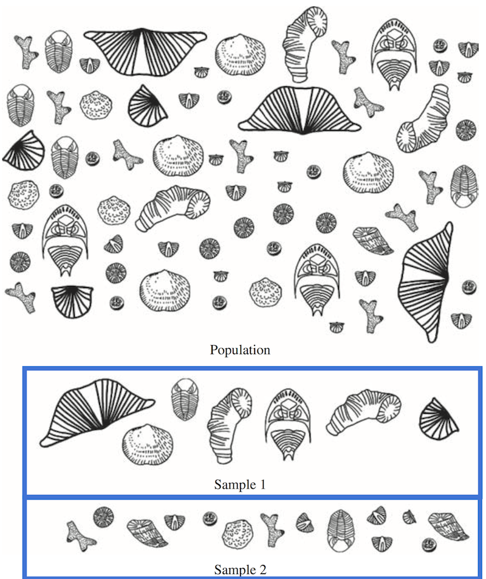

# Basic statistical terms and concepts
In the lesson for this week we will be dealing with geochronological data, ages of geological material.
These ages can be measured in many ways, but often several minerals are dated from the same sample to try to reduce the geological uncertainty in the measured ages.
Even with extremely precise dating methods and excellent equipment, ages measured in geological materials are often quite variable owing to factor such as zoning of parent isotopes in minerals, partial loss of daughter isotopes, radiactive mineral inclusions, etc.
Before we can consider any of these factors, however, we'll need to understand some of the most basic statistical concepts.

## Populations and samples
For any kind of anaylsis one might perform on geological materials, we collect a *sample*.
The ***sample*** or *sampling unit* is material collected that is a subset of a **much larger** *population*.
The ***population*** is the total number of occurences of a particular thing in a defined area, and something that is not possible for us to access geologically.
Consider an example of trying to date even a small igneous intrusion.
Of the total volume of the intrusion, only a tiny fraction is likely to be exposed at the Earth's surface.
Moreover, of the accessible part of the intrusion, we are likely to only date 10-100 minerals out of the total number present in the intrusion, which could easily be millions or more.
Even if we opt to use deep boreholes to access parts of rock layers not exposed at the surface, the volume of material sampled by the drill core is miniscule.
Thus, our goal is not to try to access a population, but rather to collect a *sample* that is *representative* of the population.

A ***representative sample*** is a sample that can be used to infer the characteristics of the population.
In other words, the sampled material represents the main features (i.e., ages, fracture orientations, mineral assemblages, etc.) of the much larger population.
Our goal as geoscientists is then to try to collect such a sample by collecting sampling units at *random*.
The trouble is, even a random sample may not be representative (Figure 1).

 
*Figure 1. ...*
