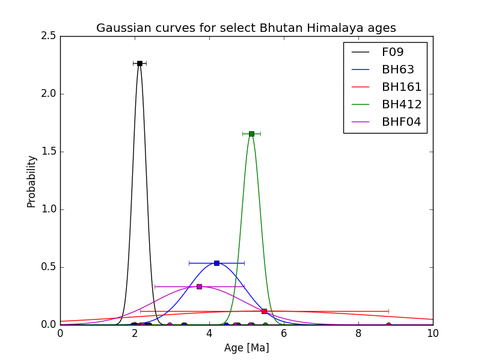

# Hints for Exercise 8
## Contents
- [General hints for Exercise 8](#general-hints)
- [Problem 1 hints](#problem-1)
- [Problem 2 hints](#problem-2)

## General hints
### Sigma notation
***Sigma notation*** is used to indicate values that should be added together or summed.
It is a shorthand notation to indicate the sum of *N* values, where each value in the set can be represented by the subscript *i*.
The example below shows how *sigma notation* works.

<br/>
*Equation H1. Sigma notation indicating the sum of N values, each indicated by x*.

As you can see, the complete form explicitly states the starting and ending values for the sum (*i* = 1 and *N*), but often these values are not written as it can be assumed that all *N* values will be summed.

## Problem 1
There have not been any major issues with Problem 1, so the only suggested hint is to refer to the [general hint on sigma notation above](#sigma-notation) if you are having any problems with converting the equations for the mean, standard deviation, and standard error to Python.

## Problem 2
### Example plot for Problem 2
Below is an example of the type of plot you should produce for Problem 2.



### Creating arrays of numbers between two values
As you may recall from [Lesson 6](https://github.com/Python-for-geo-people/Lesson-6-Intro-to-NumPy/blob/master/Lesson/intro-to-numpy.md#functions), we can use NumPy to create NumPy arrays of values between a starting and ending value.
Consider the simple example below using the `np.linspace()` method:

```python
>>> import numpy as np
>>> numberArray = np.linspace(0.0, 1.0, 11)
>>> print(numberArray)
[ 0.   0.1  0.2  0.3  0.4  0.5  0.6  0.7  0.8  0.9  1. ]
```
Here you can see we start with `0.0`, end with `1.0`, and produce an array of `11` equally spaced values that includes the starting and ending numbers.
This is probably the easiest way to create most arrays of this kind.

### Creating and appending to lists
This is mostly a reminder of something we had seen [back in Lesson 2](https://github.com/Python-for-geo-people/Diving-into-Python/blob/master/Lesson/python-basic-elements1.md#lists-and-indices).
When you are calculating the values for the normal distribution, one option is to create an empty list and append the calculated values to the list, calculating one value for each age in an age list/array from 0-10 Ma by 0.1 Ma.
You can see an example below, which assumes you have created the NumPy array `numberArray` as shown the previous hint:

```python
>>> dummyList = []
>>> for i in range(len(numberArray)):
...     dummyList.append(numberArray[i]**2.0)
...
>>> print(dummyList)   # I have rounded the values below to fit better on the screen
[0.0, 0.01, 0.04, 0.09, 0.16, 0.25, 0.36, 0.49, 0.64, 0.81, 1.0]
```
As you can see, `dummyList` ends up with the same number of values as `numberArray` (see previous hint), with one calculated value in `dummyList` for each corresponding value in `numberArray`.

### Plotting similar items using a `for` loop
One part of Problem 2 is to create a plot in which a line, some points, and an error bar should all be plotted for each sample and using the same color.
This is an excellent opportunity to use a `for` loop to create the plots, rather than listing similar pieces of code to create each set of plotted items.
The main reason for using a `for` loop is that it becomes easy to modify the format of all of the plots at the same time by making changes within the `for` loop, but it does take some preparation.
For example, it is a good idea to create a list for the sample names and for the plot item colors before the `for` loop so that you can use those values within the `for` loop.
Consider the example below.

```python
sampleNames = ["sample1", "sample2", "sample3"]
colors = ["black", "blue", "red"]
for i in range(len(sampleNames)):
    x = np.random.random(10)
    y = np.sin(x)
    x2 = np.random.random(10)
    y2 = np.cos(x2)
    e = np.random.random(10)
    plt.plot(x, y, 'o', color = colors[i], label = sampleNames[i])
    plt.errorbar(x2, y2, xerr=e, fmt='s', color=colors[i])

plt.show()
``` 
As you can see, with a bit of planning you can use a `for` loop for your plotting in Problem 2, which is suggested if you're able to get it working :sunglasses:
